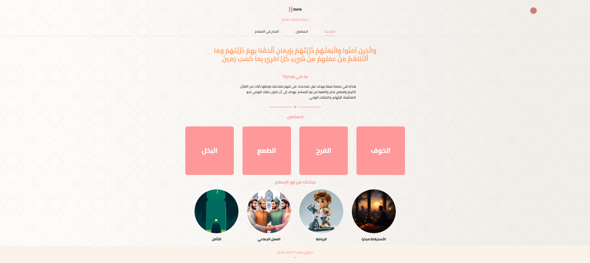
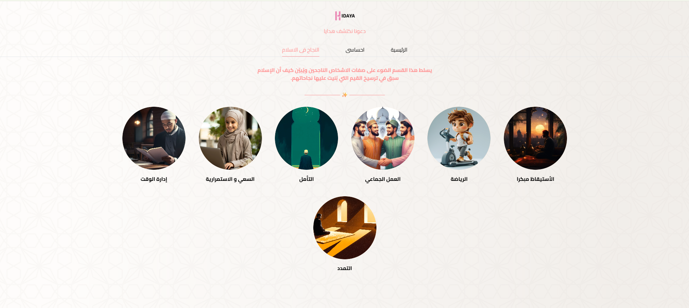

# 🕌 Hidaya – Islamic Awareness Web App

Hidaya is a modern, user-friendly website designed with a noble intention: to raise awareness about the teachings of Islam. The project showcases Islamic habits, values, and lifestyle through elegant UI, interactive components, and responsive design.

---

## 🚀 Features

- 🌙 Islamic habits and values display
- 📖 Beautiful verses from the Qur’an
- 🌐 Responsive and RTL support (Arabic)
- 🎨 Smooth transitions and loaders
- 🔍 Scroll-to-top, cursor effects, and more

---

## 🛠️ Tech Stack

- **Next.js 14** (App Router, Static Export)
- **React 18**
- **Tailwind CSS**
- **TypeScript**
- **Netlify** for deployment

---

## 📸 Screenshots

| Landing Page                     | Success Overview                 |
| -------------------------------- | -------------------------------- |
|  |  |

---

## ⚙️ Getting Started

First, clone the project and install dependencies:

```bash
git clone https://github.com/your-username/hidaya.git
cd hidaya
npm install
```

```bash
npm run dev
```
